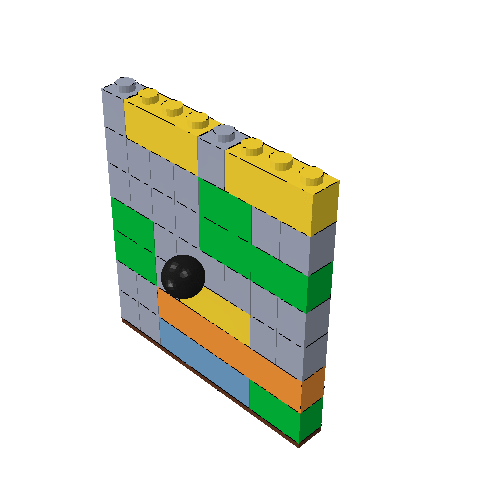
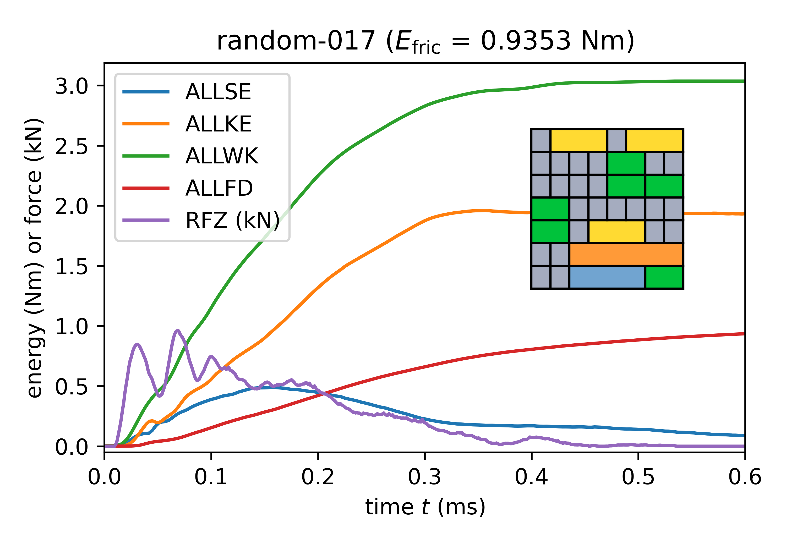
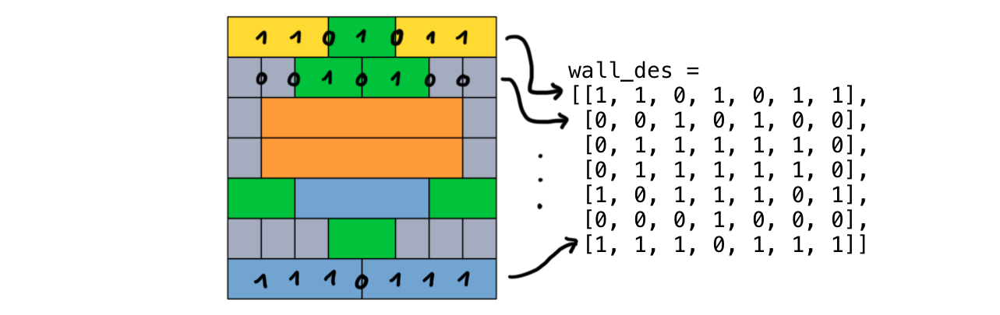
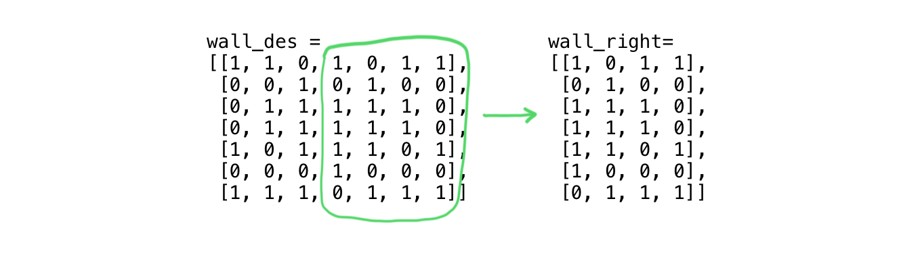

# Lego wall dataset

Contribution of the [KKV](https://www.kunststofftechnik.at/konstruieren) to the module _Digital Skills in Polymer Science_ that starts in the winter term 2025/26.

## Problem description

A lego wall is hit by a rigid sphere with a constant velocity of 20 m/s in a [scripted FEM model](https://www.github.com/mpletz/brickfem):

<div align="center">

</div>

During and after the impact, work $E_{wk}$ is done in the model, the kinetic energy $E_{kin}$ is increased, and frictional dissipation $E_{fric}$ occurs. 



It the aim of the wall is to stop a projectile or slow it down as much as possible, these energies should be maximized. Since converting the kinetic energy of the sphere to kinetic energy of the Lego bricks may not be the best option, the frictional dissipation $E_{fric}$ at the end of the simulation can be regarded as the most relevant output.

## Details on the dataset

A dataset of 5281 lego wall designs (width of 8 studs and height of 7 bricks) with the resulting $E_{wk}$, $E_{kin}$, and $E_{fric}$ is provided as a `json` file. The models were run in a previous optimization with 11 different start designs. The design is defined as described in the following. Two study next to each other can either belong to the same brick (1 in the design list) or to different bricks (0 in the design list). For each row, this means that a list of elements 0 or 1 with the length 7 can define the bricks used. The whole design list is then a list of seven such lists, starting from the top:



Since the dataset only considers symmetrical designs, each row starts from the center intersection and is therefore only a 4x7 list:



The dataset then contains the `wall_right` list and the energies at the end of the simulation:

```
"1": {"wall_right": [[1, 0, 1, 1], [1, 0, 1, 0], [0, 1, 0, 1], [0, 0, 0, 1], [0, 0, 1, 0], [1, 0, 1, 0], [1, 0, 1, 1]], "E_fric": 990.3816, "E_kin": 1202.9989, "E_wk": 2451.2402},
...
```

## Aim of the analysis

Develop a model to predict $E_{wk}$, $E_{kin}$, and $E_{fric}$ from any `wall_right` lists. Can you suggest a design with a larger $E_{fric}$ than occurring in the dataset?